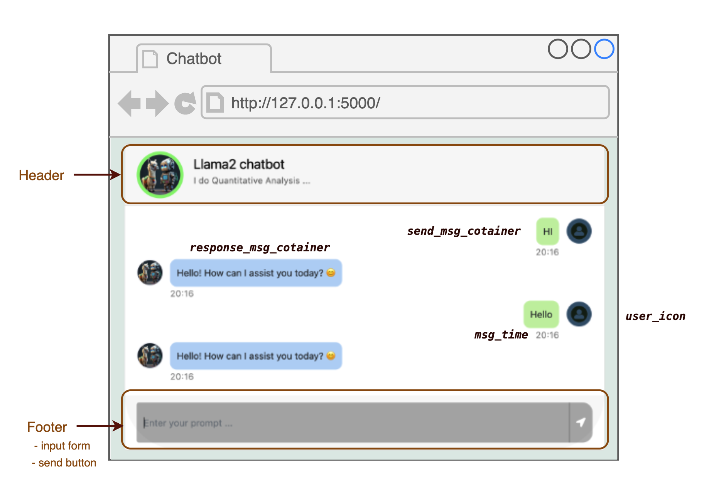
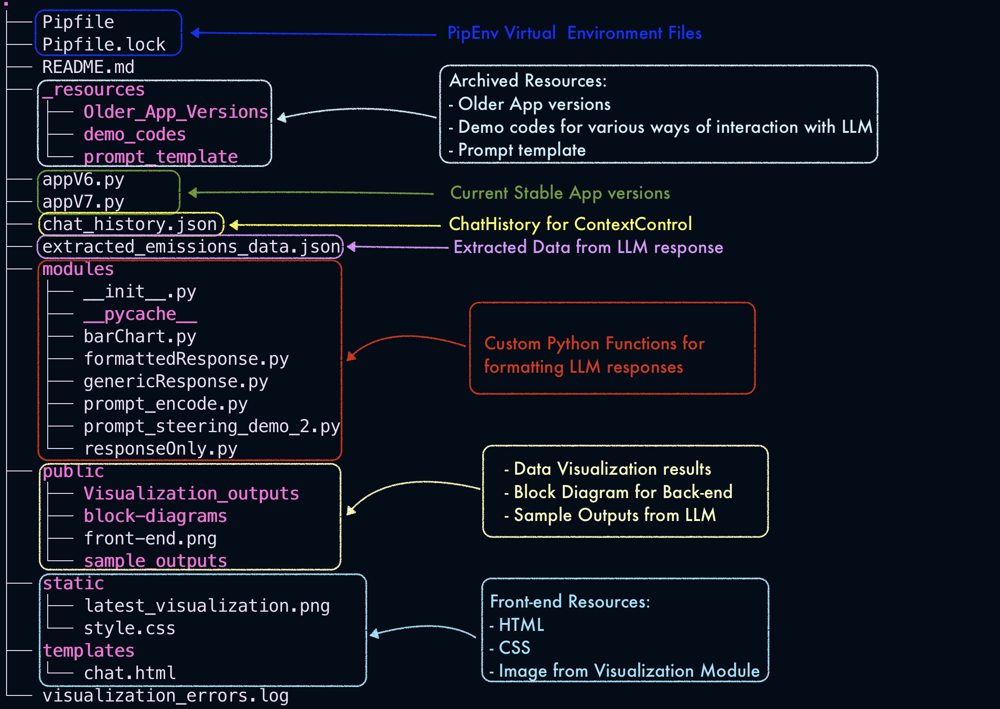

## ChatBot with LLMs

### Video Demo (click on the image)

[Watch video Demo](https://youtu.be/4hpHecae9XY)

### Architecture


### Query processing


### Front-end



### Sample Outputs


<!--  -->
<!--  -->

<!-- #### Output comparison from various models -->

<!-- 

 -->

### Repo Organization



### How to run the app

1. Setup virtual environment with [`pipenv`](https://pipenv.pypa.io/en/latest/installation.html)

2. Install dependencies

   ```
   pipenv install
   ```

   To install exact versions run:

   ```
   pipenv install --ignore-pipfile
   ```

3. Download ollama (Two approaches:)

   - form from [github](https://github.com/ollama/ollama?tab=readme-ov-file)
     or

   - from the [website](https://ollama.com/download/mac)

4. Download LLM models via ollama

   Explore list of LLM models via ollama [here](https://ollama.com/library)

   e.g. to download `llama3.2` run:

   ```
   ollama run llama3.2
   ```

5. Run the app

   ```
   python app.py
   ```

   OR

   ```
   python3 app.py
   ```

   Open in a browser:

   ```
   http://127.0.0.1:5000
   ```
